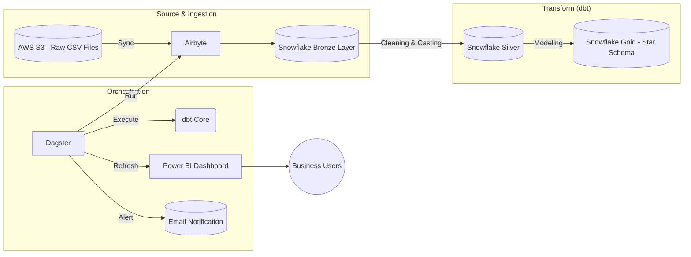

# 🚦 SafeRoute: US Traffic Accidents Data Pipeline


---

# 📌 Table of Contents

* [1. Problem](#-problem)
* [2. Project Objectives](#-project-objectives)
* [3. Dataset Overview](#-dataset-overview)
* [4. Architecture](#️-architecture)
* [5. Engineering & Data Modeling](#-engineering--data-modeling)
* [6. Orchestration & Monitoring](#-orchestration--monitoring)
* [7. Power BI Dashboards](#-power-bi-dashboards)
* [8. Project Structure](#-project-structure)
* [9. Quickstart](#-quickstart)
* [10. Team](#-team)

---

# 🔥 Problem

The United States records more than **7.7 million accidents** over 7 years.
Even though the data exists, it is **messy, inconsistent, and hard to analyze**.

### **1️⃣ Human Impact**

Millions of people are affected every year.

### **2️⃣ Economic Loss**

Billions are lost due to traffic delays, repairs, and road issues.

### **3️⃣ Poor Data Quality**

The dataset contains:

* Missing values
* Mixed data types
* Noise and outliers
* 13+ scattered boolean flags
* No ready-to-use modeling structure

📌 **In short: we have data, but no clear insights.**

---

# 🎯 Project Objectives

### **1️⃣ Centralize**

Bring all raw accident data into Snowflake in a clean structure.

### **2️⃣ Automate**

Use Airbyte, dbt, and Dagster to run the entire pipeline automatically.

### **3️⃣ Clean & Transform**

Fix data types, handle missing values, enrich data, and create a Star Schema.

### **4️⃣ Visualize**

Build dashboards that help government or analysts understand patterns and risks.

### **5️⃣ Monitor**

Detect failures and send automatic alerts.

---

# 📊 Dataset Overview

A large open dataset of US accidents (2016–2023):

### **📌 Size**

* **7.7M+ records**
* **49 states**
* **8 years of data**

### **📌 Main Data Columns**

#### **Location**

* Latitude, Longitude
* City, County, State

#### **Time**

* Start/End timestamps
* Accident duration
* Hour of day, Part of day

#### **Weather**

* Rain, Fog, Visibility
* Wind speed and direction

#### **Road Infrastructure**

* Traffic signals
* Crossings
* Junctions
* 13 boolean fields → compressed into a **Junk Dimension**

#### **Severity (1–4)**

Accident impact level.

---

# 🏗️ Architecture

Below is the full Modern Data Stack used in this project.

### **📌 Architecture Diagram (Mermaid)**



### **Static Architecture Image**


---

# 🧠 Engineering & Data Modeling

## ⭐ Star Schema Design


### **Dimensions**

* **DIM_LOCATION** — spatial + address info
* **DIM_WEATHER** — weather conditions
* **DIM_ROAD_CONFIG** — junk dimension from 13 flags
* **DIM_TIME** — hour, minute, part_of_day
* **DIM_DATE** — full date attributes

### **Fact Table**

* Accident severity
* Weather + road + location references
* Duration
* MD5 unique accident fingerprint

---

# 🧹 Data Transformation Strategy (dbt)

### **✔️ Type Safety**

Using `TRY_TO_*` functions to avoid crashes.

### **✔️ Null Handling**

`COALESCE()` to replace missing values.

### **✔️ Geospatial**

Latitude + longitude → Snowflake `GEOGRAPHY` type.

### **✔️ Data Enrichment**

Part of day (Morning, Night, Rush Hour)
Accident duration
Visibility categories

### **🔄 Lineage Graph**


---

# ⚙️ Orchestration & Monitoring

Dagster controls the entire pipeline:

### **✔️ Asset-based orchestration**

Each table is an asset with dependencies.

### **✔️ dbt only runs after Airbyte success**

### **✔️ Full visibility for every run**

### **✔️ Power BI automatic refresh**


---

# 📈 Power BI Dashboards

## **1️⃣ General Accident Overview**


## **2️⃣ Weather Effects**


## **3️⃣ Road Infrastructure**


---

# 📂 Project Structure

```
SafeRoute-Data-Pipeline/
│── assets/
│   ├── Data_flow_3.png
│   ├── Star_Shcema_model.png
│   ├── General_Statistics_dashboard.png
│   ├── Road_Statistics_dashboard.png
│   ├── Weather_Statistics_dashboard.png
│   ├── dagster_alert_email.jpg
│   ├── dbt Lineage Graph.png
│   ├── trigger_powerbi_refresh.png
│
│── dbt_project/
│   ├── models/
│   ├── analyses/
│   ├── snapshots/
│   ├── seeds/
│   ├── macros/
│   ├── tests/
│
│── orchestration/
│   ├── my_pipeline/
│   ├── my_pipeline_tests/
│
│── README.md
```

---

# 🚀 Quickstart

```bash
# Clone the repository
git clone https://github.com/amramgad8/SafeRoute-Data-Pipeline.git
cd SafeRoute-Data-Pipeline

# Install Python dependencies
pip install -r requirements.txt

# Run dbt transformations
cd dbt_project
dbt run
dbt test

# Start Dagster UI
cd ..
dagster dev
```

---

# 👥 Team

* **Amr Amgad** — Data Engineering & Cloud
* **Mark Ayman** — Data Modeling & dbt
* **Abdelrahman Khaled** — Analytics & Dashboarding

---

# 🎉 Final Notes

This project demonstrates a **fully automated, production-ready data pipeline** using a Modern Data Stack.
It processes millions of records, applies strong data modeling, and produces meaningful insights for public safety.

If you like the project, consider giving it a ⭐ on GitHub.

---

لو عايز نسخة *مركّزة أكتر* أو *مستوى Senior تقيل* أو *Enterprise-style*—قولي واظبطها لك.
