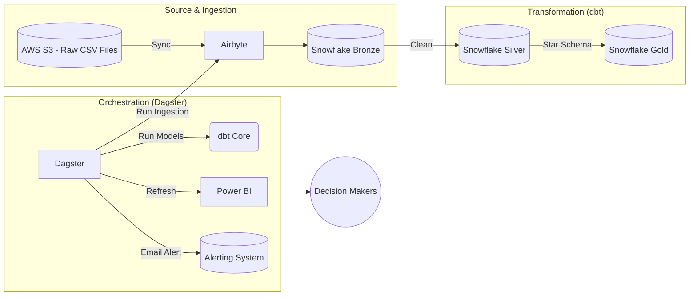
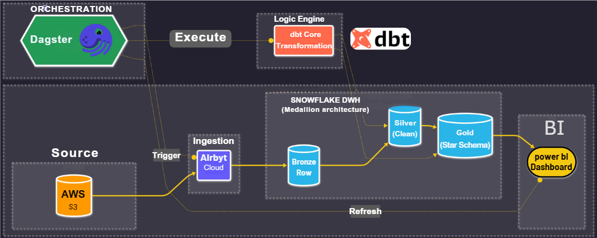
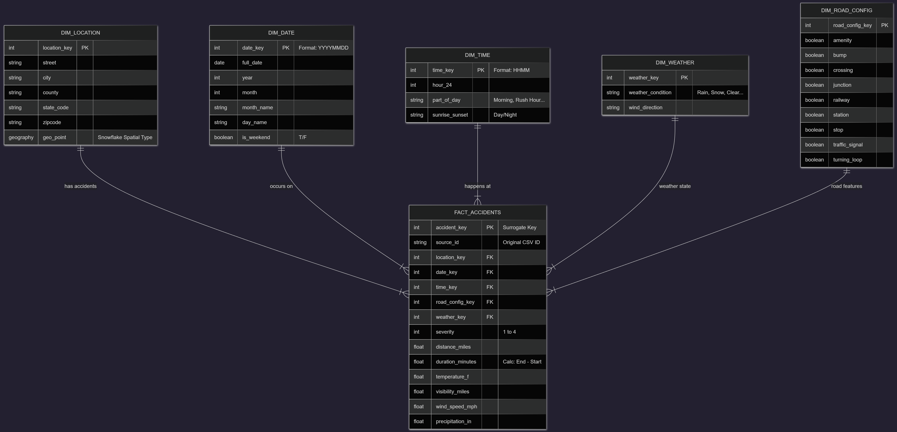
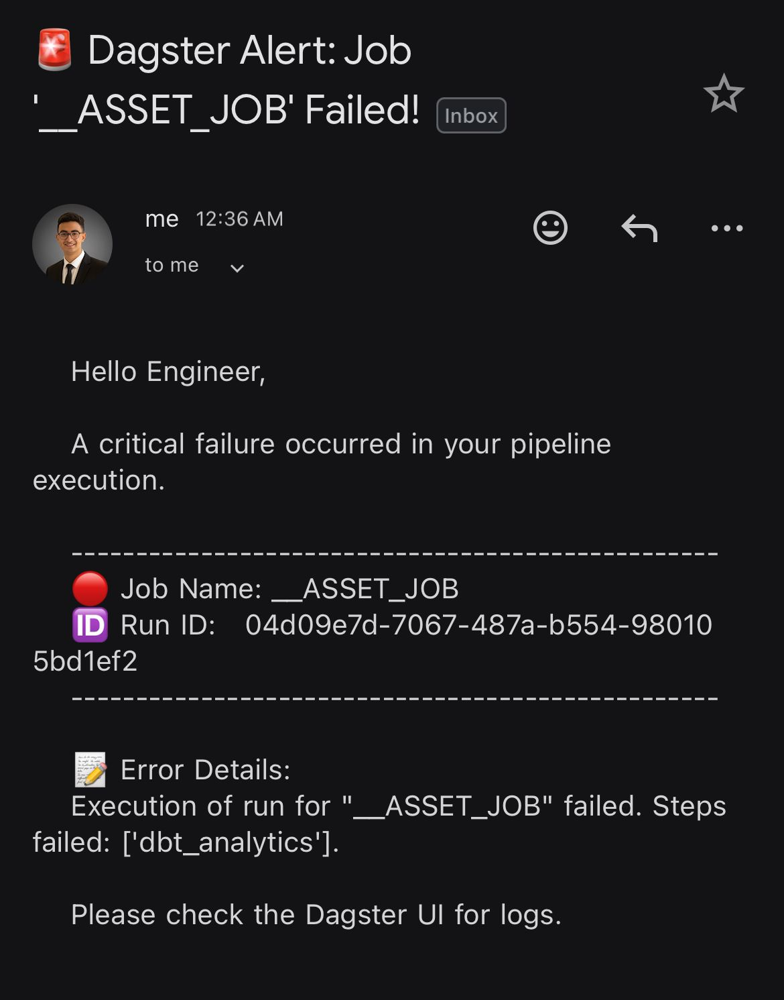
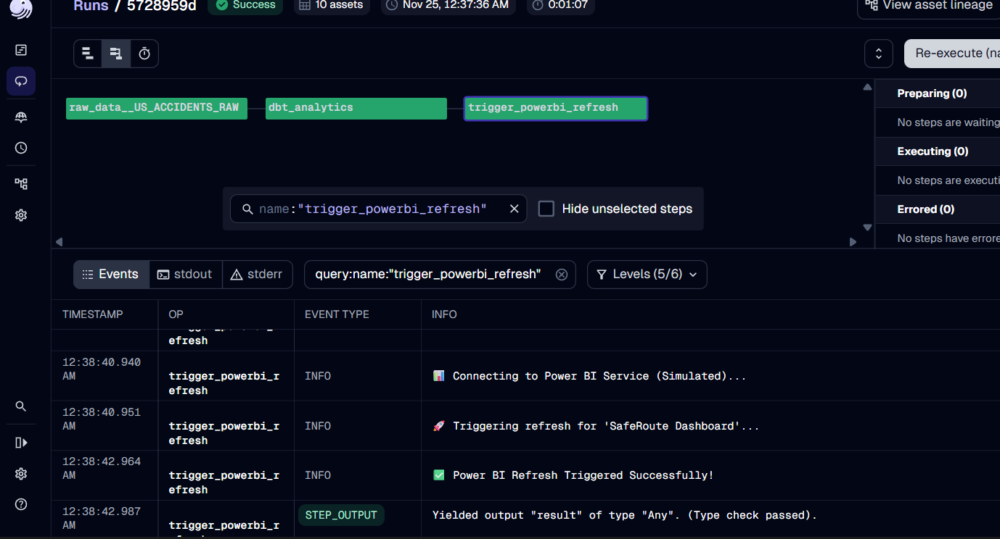
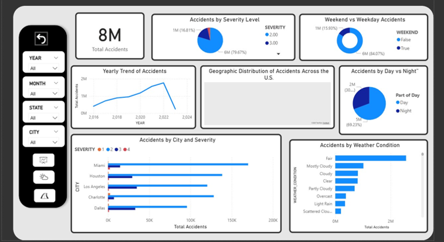
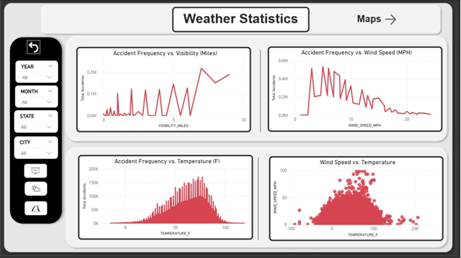
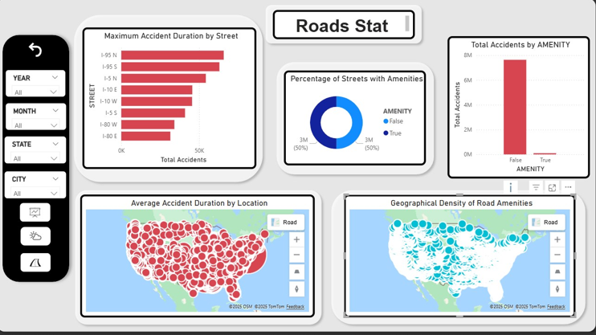

# 🚦 SafeRoute: US Traffic Accidents Data Pipeline


---

# 📌 Table of Contents

* [1. Problem](#-problem)
* [2. Project Objectives](#-project-objectives)
* [3. Dataset Overview](#-dataset-overview)
* [4. Architecture](#️-architecture)
* [5. Tech Stack](#-tech-stack)
* [6. Engineering & Data Modeling](#-engineering--data-modeling)
* [7. Optimization & Data Quality](#-optimization--data-quality)
* [8. Orchestration & Monitoring](#-orchestration--monitoring)
* [9. Power BI Dashboards](#-power-bi-dashboards)
* [10. Project Structure](#-project-structure)
* [11. Quickstart](#-quickstart)
* [12. Team](#-team)

---

# 🔥 Problem

The United States reports **over 7.7 million accidents** in just 7 years.
Even though the data is publicly available, it suffers from several issues:

### **1️⃣ Human Impact**

Accidents represent lives affected — not just numbers.

### **2️⃣ Economic Loss**

Traffic delays, damaged infrastructure, and emergency response cost billions yearly.

### **3️⃣ Unstructured & Messy Data**

The dataset includes:

* Missing values
* Inconsistent data types
* No clear modeling
* 13 scattered boolean fields
* Weather, time, and location inconsistencies

📌 **We have plenty of data, but no clear story behind it.**

---

# 🎯 Project Objectives

### **1. Centralize**

Load all raw accident data into Snowflake Bronze in a unified structure.

### **2. Automate**

Fully automated pipeline using Airbyte, dbt, and Dagster.

### **3. Transform**

Clean, standardize, and model the data into a Star Schema optimized for analytics.

### **4. Visualize**

Produce interactive dashboards for accident patterns, infrastructure risks, and weather impact.

### **5. Monitor**

Detect failures instantly and trigger alert emails for fast response.

---

# 📊 Dataset Overview

A large open dataset of US accidents (2016–2023):

### **📌 Size**

* **7.7M+ records**
* **49 states**
* **2016–2023**

### **📌 Main Attributes**

* **Location:** lat/lon, city, county
* **Time:** start & end timestamps, duration
* **Weather:** visibility, wind, conditions
* **Road features:** traffic signal, crossing, junctions
* **Severity:** level 1 → 4

---

# 🏗️ Architecture

### **Mermaid Pipeline Diagram**



### **Static Architecture**



---

# 🧰 Tech Stack

| Tool                  | Purpose                                                   |
| --------------------- | --------------------------------------------------------- |
| **AWS S3**            | Stores raw CSV accident data                              |
| **Airbyte Cloud**     | Syncs and loads raw data into Snowflake                   |
| **Snowflake**         | Data warehouse using Bronze → Silver → Gold layers        |
| **dbt Core**          | Cleans, transforms, models, and tests the data            |
| **Dagster**           | Orchestrates the entire pipeline and manages dependencies |
| **Power BI**          | Final dashboards for analytics                            |
| **SMTP Email Alerts** | Sends failure/notif alerts from Dagster                   |

---

# 🧠 Engineering & Data Modeling

## ⭐ Star Schema



The Gold layer uses a classic Star Schema to ensure simple, fast analytics:

* **FACT_ACCIDENTS** stores measures and keys
* Dimensions: **Location**, **Weather**, **Time**, **Road Config**, **Date**

---

# 🔧 Optimization & Data Quality

### **✔️ MD5 Fingerprint Key**

To guarantee each accident is uniquely identified, I generated an MD5 hash based on critical fields such as:
`Start_Time + Latitude + Longitude + Description`

This prevents duplicate loading and ensures stable primary keys across layers.

---

### **✔️ Clustering in Snowflake**

To speed up geospatial and time-based queries:

* Clustered **FACT_ACCIDENTS** by:

  * `Start_Date`
  * `State`
  * `GeoPoint`

Result:
Much faster filtering by state, date, and map layers, especially for dashboards.

---

### **✔️ dbt Testing**

Included:

* Unique tests
* Non-null tests
* Relationship integrity
* Custom tests like checking:
  `End_Time > Start_Time`

---

### **✔️ Robust Staging**

* Type casting using `TRY_TO_*`
* Null handling via `COALESCE()`
* Derived fields (part_of_day, duration, visibility category)

---

# ⚙️ Orchestration & Monitoring

### **Dagster manages the entire ELT workflow**

* Runs Airbyte sync
* Runs dbt models
* Refreshes Power BI
* Sends alerts if any step fails

### **Email Alert (Failure Notification)**



### **Run Example**



---

# 📈 Power BI Dashboards

## **1️⃣ General Overview**



---

## **2️⃣ Weather Impact**



---

## **3️⃣ Road Infrastructure Statistics**



---

# 📂 Project Structure

```
SafeRoute-Data-Pipeline/
│── assets/
│── dbt_project/
│── orchestration/
│── README.md
```

---

# 🚀 Quickstart

```bash
# Clone the repository
git clone https://github.com/amramgad8/SafeRoute-Data-Pipeline.git
cd SafeRoute-Data-Pipeline

# Install dependencies
pip install -r requirements.txt

# Run dbt
cd dbt_project
dbt run
dbt test

# Start Dagster
cd ..
dagster dev
```

---

# 👥 Team

* **Amr Amgad** — Data Engineering & Cloud
* **Mark Ayman** — Data Modeling
* **Abdelrahman Khaled** — Analytics & Visualization

---

# 🎉 Final Note

SafeRoute delivers a **production-grade modern data pipeline** integrating ingestion, transformation, orchestration, and analytics — fully automated and optimized for performance.

If you found this project useful, feel free to ⭐ the repo!

---
