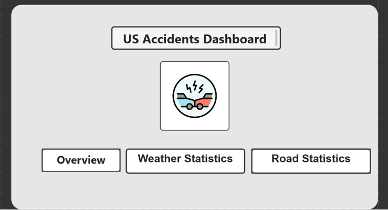

# 🚦 SafeRoute: End-to-End US Traffic Accidents Data Pipeline


> **SafeRoute** is a robust data engineering solution designed to process, transform, and analyze over **7.7 million traffic accident records** across the US. The project leverages a Modern Data Stack to provide actionable insights for improving road safety infrastructure.

---

## 🏗️ Architecture Overview

The pipeline follows the **Medallion Architecture** (Bronze, Silver, Gold) to ensure data quality and scalability. Data flows from raw CSVs in AWS S3 to actionable insights in Power BI.


### 🔄 Data Flow Summary
1.  **Ingestion:** Airbyte extracts raw data from **AWS S3** and loads it into **Snowflake (Bronze Layer)**.
2.  **Transformation:** dbt Core performs data cleaning, type casting, and testing to create the **Silver Layer**.
3.  **Modeling:** dbt models the data into a **Star Schema** (Gold Layer) optimized for analytics.
4.  **Orchestration:** Dagster manages the entire workflow, dependencies, and alerting.
5.  **Visualization:** Power BI connects to the Gold Layer for reporting.

### Interactive Architecture Map
```mermaid
graph LR
    subgraph "Source & Ingestion"
        S3[(AWS S3 Data Lake)] -->|Raw CSV| Airbyte[Airbyte Cloud]
        Airbyte -->|Trigger| SnowBronze[(Snowflake Bronze)]
    end

    subgraph "Transformation (dbt)"
        SnowBronze -->|Clean & Cast| SnowSilver[(Snowflake Silver)]
        SnowSilver -->|Star Schema| SnowGold[(Snowflake Gold)]
    end

    subgraph "Orchestration & BI"
        Dagster{Dagster} -->|Manage| Airbyte
        Dagster -->|Run| dbt(dbt Core)
        Dagster -->|Refresh| PBI[Power BI Dashboard]
        Dagster -->|Alert| Email((Gmail Alert))
    end

    classDef tool fill:#f9f,stroke:#333,stroke-width:2px;
    class Airbyte,dbt,Dagster,PBI tool;
````

---

## 🚀 Optimization & Data Strategy

Handling 7.7M+ records required strict optimization strategies to ensure performance and reduce cloud costs:

### 1. Data Selection Strategy

We reduced the dataset volume by approximately **20%** by filtering out low-impact columns (e.g., `Wind_Chill`, `Humidity`, `Civil_Twilight`) that added noise without analytical value.

### 2. Junk Dimension Implementation

Instead of keeping 13 separate boolean columns (e.g., `Bump`, `Crossing`, `Traffic_Signal`) in the Fact table—which would increase width and slow down queries—we implemented a **Junk Dimension strategy**. We combined these flags into unique configuration keys in `DIM_ROAD_CONFIG`.

### 3. Snowflake Optimization

* **Geography Data Type:** Utilized Snowflake's native `GEOGRAPHY` type for accurate spatial analysis.
* **Dedicated Warehouses:** Separated compute resources for ingestion (Airbyte) and transformation (dbt) to prevent resource contention.

---

## 📊 Data Modeling (Star Schema)

We designed a Star Schema centered around `FACT_ACCIDENTS` to facilitate fast aggregations and slicing. The schema ensures that our analytics are both fast and intuitive for end-users.


### Dimensions Breakdown:

* **`DIM_LOCATION`**: Contains hierarchical address data (City, County, State) and geospatial points. It uses MD5 surrogate keys for integrity.
* **`DIM_TIME`**: A derived dimension handling Hour, Part of Day (Morning, Rush Hour), and Day/Night indicators to analyze temporal patterns.
* **`DIM_ROAD_CONFIG`**: Stores the unique combinations of road infrastructure features (Signals, Junctions, etc.).
* **`DIM_WEATHER`**: Captures weather conditions (Rain, Fog) and wind direction to correlate environmental factors with accidents.
* **`DIM_DATE`**: A standard date spine supporting weekend/weekday analysis.

---

## 🚨 Orchestration & Monitoring

Reliability is key. We implemented **Dagster Sensors** to monitor pipeline health in real-time. If any asset fails (e.g., dbt test failure or Airbyte sync error), an automated email alert is triggered immediately via SMTP.


> Real-time critical failure alert sent to the engineering team ensuring rapid incident response.

---

## 📈 Analytics & Dashboard

The final output is a suite of Power BI dashboards used to identify accident hotspots, weather correlations, and road infrastructure impacts.



### 1. General Overview Dashboard

Provides high-level metrics covering total accidents (7.7M), severity distribution, and yearly trends to give stakeholders a quick pulse on traffic safety.


### 2. Weather Impact Analysis

Correlates visibility, wind speed, and precipitation with accident frequency to identify dangerous conditions and help in planning weather-related advisories.


### 3. Road Infrastructure Statistics

Analyzes the impact of specific road features (e.g., Junctions, Traffic Signals) on accident rates and severity, helping urban planners pinpoint infrastructure improvements.


---

## 🛠️ Tech Stack

| Component          | Tool              | Description                                                                                         |
| :----------------- | :---------------- | :-------------------------------------------------------------------------------------------------- |
| **Data Lake**      | **AWS S3**        | Stores raw CSV data (partitioned/stored securely).                                                  |
| **Ingestion**      | **Airbyte Cloud** | Automates data loading from S3 to Snowflake (Bronze Layer).                                         |
| **Warehouse**      | **Snowflake**     | Cloud DWH hosting the Medallion Architecture layers.                                                |
| **Transformation** | **dbt Core**      | Performs data cleaning, testing, and modeling (Junk Dimensions, Surrogate Keys).                    |
| **Orchestration**  | **Dagster**       | Manages dependencies, assets, and creates a sensor-based trigger for pipeline failure (Gmail SMTP). |
| **Visualization**  | **Power BI**      | Interactive dashboard for geospatial and trend analysis.                                            |

---

## 👥 Team (SIC 7 - Group 11)

* **Amr Amgad** - Data Engineering & Cloud Infrastructure
* **Mark Ayman** - Data Modeling & Transformation
* **Abdelrahman Khaled** - Analysis & Visualization

---

*Project developed as part of the Samsung Innovation Campus (SIC) Graduation Program.*

```

لو حابب تغيّر ترتيب أي صورة (مثلاً تحط الـ Star Schema قبل/بعد النص) قول لي أي قسم تعدّله وأظبطه لك.
```
