# 🚦 SafeRoute: US Traffic Accidents Data Pipeline


> **A comprehensive, automated data engineering solution to analyze 7.7 million US traffic accidents (2016–2023), transforming raw unstructured logs into actionable intelligence.**

---

## 📌 Table of Contents

1. [Business Problem & Context](#-business-problem--context)
2. [Project Objectives](#-project-objectives)
3. [Dataset Overview](#-dataset-overview)
4. [Solution Architecture](#-solution-architecture)
5. [Tech Stack](#-tech-stack)
6. [Engineering & Data Modeling](#-engineering--data-modeling)
7. [Optimization, Quality & Testing](#-optimization-quality--testing-highlights)
8. [Orchestration & Monitoring](#-orchestration--monitoring)
9. [Power BI Dashboards](#-power-bi-dashboards)
10. [Quickstart](#-quickstart)
11. [Team](#-team)

---

## 🔥 Business Problem & Context

The United States reports **over 7.7 million traffic accidents** from 2016 to 2023.
Despite this massive dataset, it remains difficult to analyze due to:

### 1️⃣ Human Impact

Accidents represent real lives affected, not just numbers.

### 2️⃣ Economic Loss

Billions are lost due to road damage, delays, and emergency response.

### 3️⃣ Unstructured & Messy Data

The dataset suffers from:

* Missing values
* Mixed data types
* 13+ scattered boolean flags
* Weather, road, and time fields mixed without modeling
* No analytical schema

➡️ **Goal:** Turn raw, messy logs into clean, modeled, analytics-ready data.

---

## 🎯 Project Objectives

1. **Centralize** — Collect all raw accident data into Snowflake (Bronze Layer).
2. **Automate** — Build a full automated ELT pipeline using Airbyte, dbt, and Dagster.
3. **Transform** — Clean, standardize, and model the data into a Star Schema (Gold Layer).
4. **Visualize** — Create dashboards that reveal accident patterns & risk indicators.
5. **Monitor** — Detect failures instantly & trigger email alerts in real time.

---

## 📊 Dataset Overview

**Volume:** 7,700,000+ accident records
**Coverage:** 49 states
**Timeline:** 2016–2023
Source: [US Accidents Dataset on Kaggle](https://www.kaggle.com/datasets/sobhanmoosavi/us-accidents)
### 📌 Key Attributes

| Category          | Description                                                            |
| ----------------- | ---------------------------------------------------------------------- |
| **Location**      | Latitude, Longitude, City, County, State                               |
| **Time**          | Start/End time, Duration, Part of day                                  |
| **Weather**       | Condition, Visibility, Wind Speed, Precipitation                       |
| **Road Features** | Traffic Signal, Junction, Bump, Crossing (13 boolean flags → Junk Dim) |
| **Severity**      | Levels 1 → 4                                                           |

---

## 🏗 Solution Architecture

The pipeline follows the **Medallion Architecture** (Bronze → Silver → Gold).

### **Mermaid Architecture Diagram**

```mermaid
graph LR
    %% =========================
    %% NODES & SUBGRAPHS
    %% =========================
    subgraph Source
        S3[(AWS S3\nRaw Files)]
    end

    subgraph "Ingestion (EL)"
        Airbyte[Airbyte\nCloud]
    end

    subgraph "Snowflake DWH\n(Medallion)"
        Bronze[(Bronze\nRaw)]
        Silver[(Silver\nClean)]
        Gold[(Gold\nStar Schema)]
    end

    subgraph "BI & Consumers"
        PowerBI[Power BI\nDashboards]
        DecisionMakers((Stakeholders))
    end

    subgraph "Orchestration & Control"
        Dagster[Dagster]
        dbtCore[dbt Core]
        Email[(Email / Alerts)]
    end

    %% =========================
    %% DATA FLOW (EL + DWH + BI)
    %% =========================
    S3 -->|Sync EL| Airbyte
    Airbyte -->|Load| Bronze
    Bronze -->|Clean & Cast| Silver
    Silver -->|Star Schema| Gold
    Gold -->|Publish Models| PowerBI
    PowerBI -->|Insights| DecisionMakers

    %% =========================
    %% ORCHESTRATION / CONTROL
    %% =========================
    Dagster -->|Trigger EL| Airbyte
    Dagster -->|Run Models| dbtCore
    Dagster -->|Refresh Dashboards| PowerBI
    Dagster -.->|Alert on Failure| Email

    %% dbt يتحكم ÙÙŠ التحويلات بين الطبقات
    dbtCore -.Transforms.-> Bronze
    dbtCore -.Transforms.-> Silver
    dbtCore -.Transforms.-> Gold

    %% =========================
    %% STYLES
    %% =========================
    classDef source       fill:#FFE0B2,stroke:#EF6C00,stroke-width:2px,color:#000;
    classDef ingestion    fill:#E1F5FE,stroke:#0277BD,stroke-width:2px,color:#000;
    classDef dwh          fill:#E8F5E9,stroke:#2E7D32,stroke-width:2px,color:#000;
    classDef bi           fill:#FFF3E0,stroke:#FB8C00,stroke-width:2px,color:#000;
    classDef orchestration fill:#EDE7F6,stroke:#5E35B1,stroke-width:2px,color:#000;
    classDef external     fill:#F3E5F5,stroke:#6A1B9A,stroke-dasharray:3 3,color:#000;

    class S3 source;
    class Airbyte ingestion;
    class Bronze,Silver,Gold dwh;
    class PowerBI,DecisionMakers bi;
    class Dagster,dbtCore orchestration;
    class Email external;

```



### **Static Architecture**


---

## 🧰 Tech Stack

| Component           | Technology    | Function                             |
| ------------------- | ------------- | ------------------------------------ |
| **Storage**         | AWS S3        | Stores raw CSV files                 |
| **Ingestion**       | Airbyte Cloud | Syncs S3 data → Snowflake            |
| **Warehouse**       | Snowflake     | Stores Bronze → Silver → Gold layers |
| **Transformations** | dbt Core      | Cleaning, modeling, testing          |
| **Orchestration**   | Dagster       | Automates ELT workflow & alerts      |
| **Visualization**   | Power BI      | Dashboards & analytics               |
| **Alerting**        | SMTP Email    | Sends pipeline failure alerts        |

---

## 🧠 Engineering & Data Modeling

### ⭐ Star Schema (Gold Layer)


* **FACT_ACCIDENTS**: metrics like duration, severity, distance
* **DIM_LOCATION**: city, county, state, geospatial point
* **DIM_WEATHER**: rain, fog, visibility, wind
* **DIM_TIME**: hour, minute, part_of_day
* **DIM_DATE**: calendar attributes
* **DIM_ROAD_CONFIG**: junk dimension (13 boolean fields combined)

---

## 🔧 Optimization, Quality & Testing Highlights

### ✔️ 1. MD5 Fingerprint Key (Uniqueness Guarantee)

To ensure **idempotent loads** and **no duplicate accidents**, each record gets a unique, stable key:

```
MD5(Start_Time + Latitude + Longitude + Description)
```

This prevents duplication even across different ETL runs and years.

---

### ✔️ 2. Snowflake Clustering

To speed up dashboard queries:

* **Cluster Keys:**

  * `Start_Date`
  * `State`
  * `GeoPoint`

Result:
🔹 Reduced micro-partition scans
🔹 Faster geospatial and timeline filtering
🔹 Faster BI reporting

---

### ✔️ 3. dbt Testing & Quality Checks

* **not_null** tests for all natural keys
* **unique** on surrogate keys
* **relationships** between FACT + DIMs
* Custom quality rule:

```
End_Time must always be greater than Start_Time
```

---

### ✔️ 4. dbt Lineage Graph


---

## ⚙ Orchestration & Monitoring

Dagster runs and monitors the entire pipeline.

### **✔️ Triggering Power BI Refresh**

<p align="left">
  
</p>

---

### 🚨 Email Alerting System (Failure Detection)

If any step fails, Dagster instantly sends an automatic email.

<p align="left">
  
</p>


---

# 📈 Power BI Dashboards

## 1️⃣ General Overview


## 2️⃣ Weather Impact


## 3️⃣ Road Infrastructure Statistics


---

# 🚀 Quickstart

```bash
# Clone repository
git clone https://github.com/amramgad8/SafeRoute-Data-Pipeline.git
cd SafeRoute-Data-Pipeline

# Install dependencies
pip install -r requirements.txt

# Run dbt
cd dbt_project
dbt deps
dbt build

# Start Dagster
cd ../orchestration
dagster dev
```

---

# 👥 Team

* **Amr Amgad** – Data Engineering & Cloud
* **Abdelrahman Khaled** – Data Modeling
* **Mark Ayman** – Analytics & Visualization

---

# 🎉 Final Note

SafeRoute delivers a *production-grade*, automated, analytics-ready data pipeline built on the Modern Data Stack.

If the project inspired you, feel free to ⭐ the repo!

---
